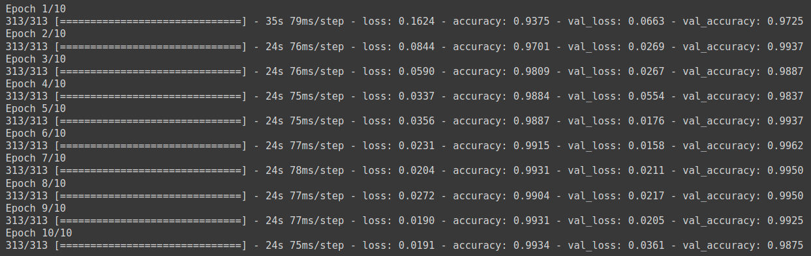
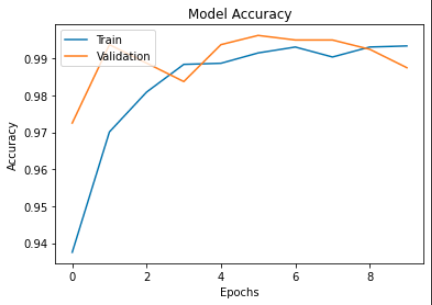
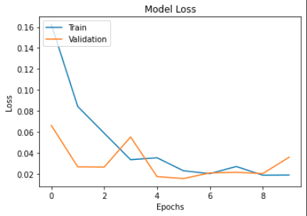
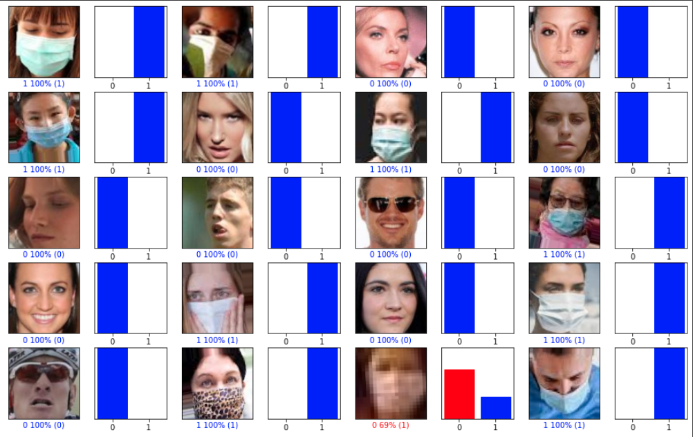

# Real-Time Face Mask Detection

Using neural networks, this real-time application can locate faces and predict whether they are wearing hygienic masks or not using the computer's webcam.

# :warning: :construction: UNDER CONSTRUCTION :construction: :warning:

# Atualizações necessárias

1. Finish Demo and results

## 1. Introduction

Recently, in December 2019, the city of Wuhan, China, became the center of an outbreak of a "pneumonia" of unknown origin. In January, Chinese scientists discovered the origin of a new coronavirus (SARS-CoV-2) that is causing these pneumonias. In February 2020, these pneumonias were named Covid-19 by the World Health Organization, a new disease that spread worldwide and soon became a pandemic.

In the quest to contain the advance of this new disease, several countries have made the use of face masks for respiratory protection mandatory. This determination thus decreased the contamination rate of the population and consequently the mortality rate.

Bearing in mind that a part of the population still has mistaken doubts about the need and effectiveness of the use of masks, and therefore does not respect the mandatory use of them. We created a real-time application to detect, through the use of cameras, faces and predict, through neural networks, whether they are wearing some kind of mask or not.

## 2. Objectives

Create and train an artificial intelligence model that can help verify the use of masks in spaces that have cameras, becoming a means for effective and secure monitoring.

## 3. Methods

First, a convolution neural network (CNN) was created and trained using Google Colab. The dataset was obtained through the Kaggle platform, with about 12 thousand images being divided into people with masks and without masks. After creating the CNN, the application was developed, using the OpenCV library so we could easily access the computer's webcam and use a Cascade Classifier to get the regions of a certain image that has one or more faces. With this in hand, we put the neural network to perform the prediction on the regions of faces, returning if a certain person is using the mask or not.

## 4. Demo

...

## 5. Results

The classification model was trained for 10 epochs, resulting in a validation percentage of 98.75%. It is possible to observe that we could have used the Early Stop technique to get higher values, but to simplify and not perform checkpoints only the last one was saved.

The variation in accuracy and Loss over the epochs is seen in the 2 graphs below.

Accuracy            |  Loss
:-------------------------:|:-------------------------:
  |  

Below you can see some samples used in the validation, the bar in the index "0" means the percentage that the model made the prediction to be of the class "Without_Mask", and the bar in the index "1" the percentage of prediction "With_Mask". When the results are in blue it means that the model predicted correctly, when they are in red the model got the final result wrong.

## 6. Conclusion

We obtained excellent results in the prediction of the convolutional neural network, having an accuracy rate of 98.75% in the validation set. And when run in the real time application, the results remained satisfactory.

## 7. Issues and future improvements

The Cascade Classifier had problems detecting the faces in the camera, especially when masks were used. We tested other Cascade Classifiers, but they showed little improvement and demanded a higher computational cost, resulting in a decrease in FPS. 

Although the application can run in real time, we still have a low FPS rate, around 40 frames per second without face detection, when a face is detected and the CNN is executed, this rate drops to 15 frames per second (values with the algorithm running on CPU).

Therefore, we can conclude that the future improvements needed would be the search or the creation and training of a better face detector, and to be able to run the algorithm on a GPU, trying our best to increase the FPS rate.

## 8. References

[1] - [Kaggle Dataset](https://www.kaggle.com/datasets/ashishjangra27/face-mask-12k-images-dataset)

[2] - [OpenCV Library](https://github.com/opencv/opencv/tree/master)

[3] - [TensorFlow Documentation](https://www.tensorflow.org/api_docs/python/tf)

[4] - [Chando0185 Project](https://github.com/Chando0185/Face_Mask_Detection)
